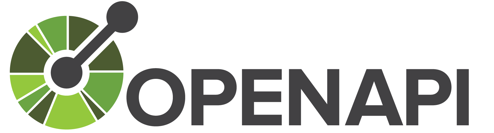
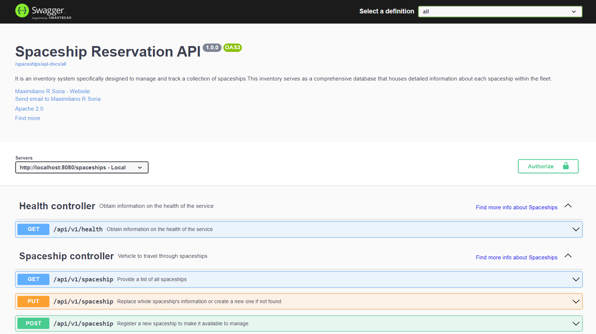
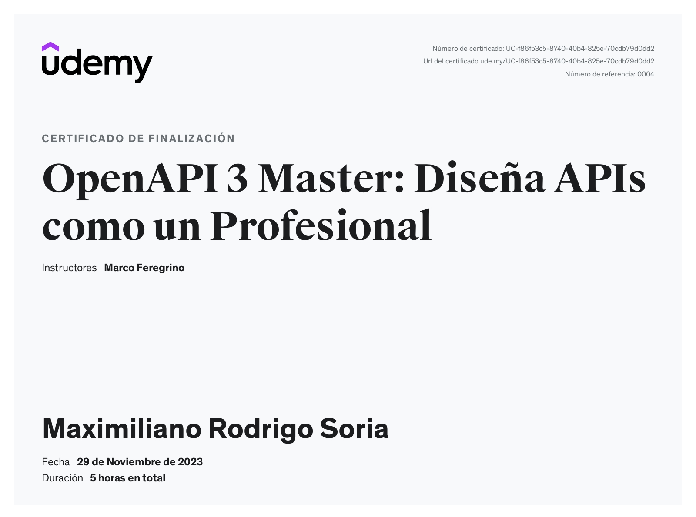

<p align="center">
<a href="https://www.linkedin.com/in/soriamaximilianorodrigo/" target="_blank" rel="noopener noreferrer">
</a></p>


<p align="center">
  <a href="#"></a>
  <a href="#"></a>
  <a href="#"></a>
</p>

<br>
<br>
<p align="center">
<a href="https://www.linkedin.com/in/soriamaximilianorodrigo/" target="_blank" rel="noopener noreferrer">
</a></p>


## 🚀 Introduction

The presented API serves as an illustrative model featuring a set of endpoints centered around Spaceship. The primary objective of this repository is to comprehensively document a collection of endpoints using **OpenAPI** standards.

## 🔨 Build and Run

## Prerequisites

Ensure you have the following installed on your system:

- Java Development Kit (JDK 11)
- Maven

## Steps

### 1. Clone the Repository

Clone your Spring Boot API repository to your local machine:

```bash
git clone https://github.com/MaximilianoRodrigoSoria/spaceship-api.git
```
```
cd spaceship-api
```

### 2. Build the Project

Navigate to the root directory of your project and execute the following Maven command to build the project:
```
mvn clean install
```

### 3. Run the Application
Once the build is successful, you can run your Spring Boot application using the following command:
```
mvn spring-boot:run
```

### 4. Access the API
Your Spring Boot API should now be accessible at the default port 8080. Open your web browser or a tool like Postman and access the following URL:

> http://localhost:8080/spaceships/swagger-ui.html

</a></p>
## 📜 License

[Apache 2.0](http://springdoc.org)

---

### ⭐ Udemy course

These examples are given by the Udemy course **OpenAPI 3 Master: Diseña APIs como un Profesional)**


Link: https://www.udemy.com/course/diseno-apis-openapi/


#### Course objective

1. APIs as Products: Discover why APIs are not just a technology but genuine drivers of business growth, both internally and externally.
2. Design with OpenAPI Spec: Master the most widely accepted standard in the world of APIs. Additionally, understand how it seamlessly integrates with cloud giants like AWS.
3. Quality and Usability: Learn to design APIs that your consumers will love. We will cover:
   - Standards and RFCs
   - Best practices in design 
   - Proper use of HTTP methods and response codes 
   - REST architecture patterns

<br/>
<br/>

### ⭐ Certificate


<p align="center">
<a href="https://www.udemy.com/certificate/UC-f86f53c5-8740-40b4-825e-70cdb79d0dd2/" target="_blank" rel="noopener noreferrer">
</a></p>

> [!NOTE]
> You can access the certificate by clicking on the image.
---
<br/>

### ⭐ Autor
<br>

> ‍💻 **Name:** Maximiliano Rodrigo Soria
>
> 📧 **Email:** MaximilianoRodrigoSoria@gmail.com
>
> 🏠 **From:** Florencio Varela, Alpino
>
> 💼 **Linkedin:** [SoriaMaximilianoRodrigo](https://www.linkedin.com/in/soriamaximilianorodrigo/)
>
> 💬 **Chat:**  [Inicia un chat](https://wa.me/1127043256) 
